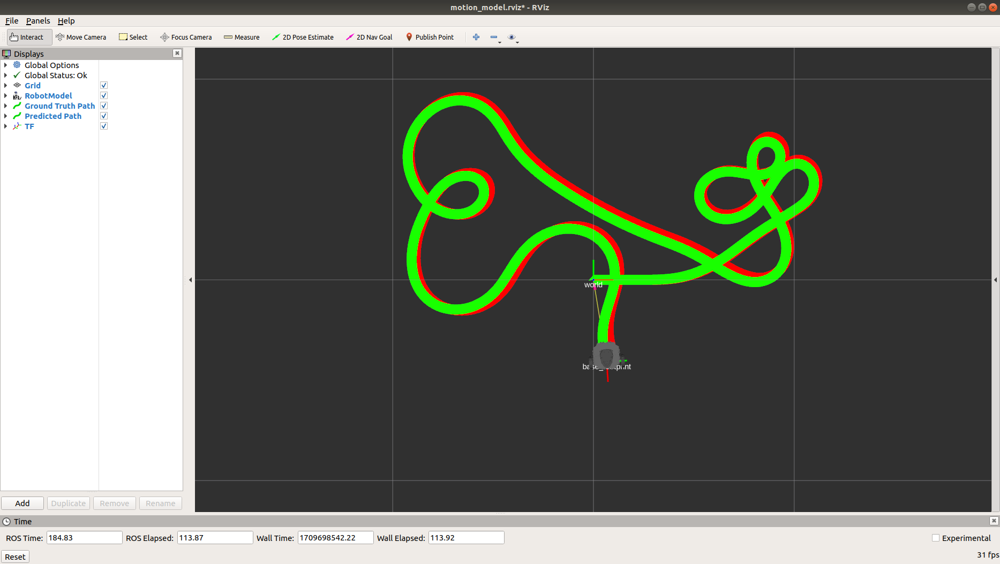

# Robot Motion Model

This package provides implementation of different robot motion models, their comparison against ground truth, and visualization.

To use this package, first launch turtlebot3 simulation
```
roslaunch turtlebot3_gazebo_simple turtlebot3_empty_world.launch
```
Then, launch motion model computation and visualization
```
roslaunch robot_motion_model robot_motion_model.launch motion_model:=<model name>
```
Lastly, launch teleoperation of the robot
```
export TURTLEBOT3_MODEL=burger
roslaunch turtlebot3_teleop turtlebot3_teleop_key.launch
```

In the rviz visualization, green path is the ground truth path based on the ground truth `/odom`. The red path is the predicted path based on the motion model.
<p align="center">
  
</p>